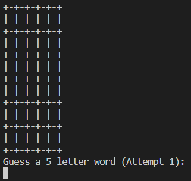
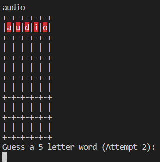
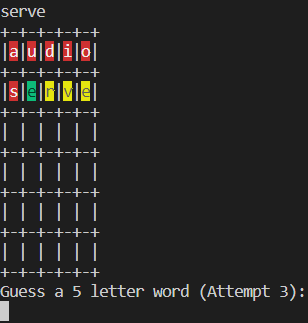
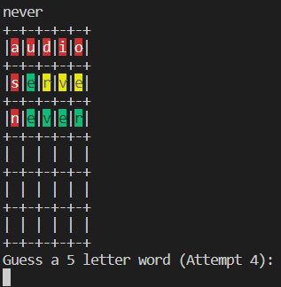
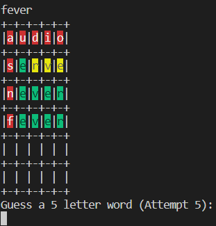
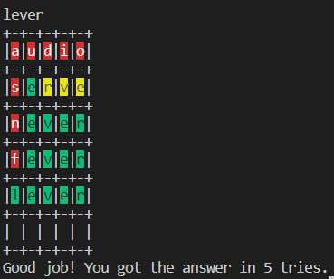

# JavaWordle

## Core Java mini project

Must download .java file and both .txt files (they are the dictionaries). Do not rename these .txt files. Exception will be thrown if files are not present or if they are renamed (unless you modify the code yourself to provide the correct path).

_Note that the output display only works on Visual Studio Code._ Regular terminal or Eclipse do not support the background colour settings in this code.

Here is how it should look like:

